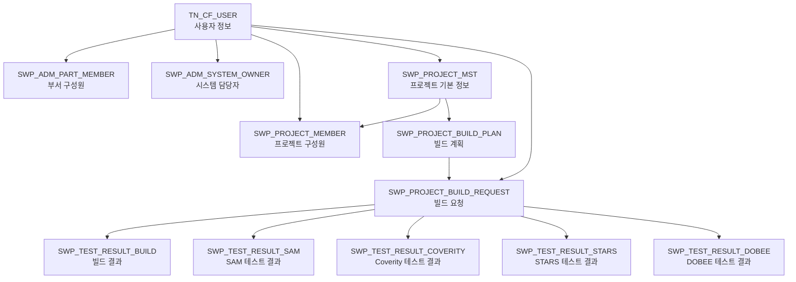

# SWDP 데이터베이스 전체 스키마 (Comprehensive SWDP Database Schema)

```json
{
  "name": "swdpdb",
  "description": {
    "en": "Executes SQL queries against the SWDP database (MySQL 5.7) and returns the results. The database contains software project management information such as build requests, test results, and team memberships.",
    "ko": "SWDP 데이터베이스(MySQL 5.7)에 대해 SQL 쿼리를 실행하고 결과를 반환합니다. 이 데이터베이스는 빌드 요청, 테스트 결과, 팀 구성원 정보 등의 소프트웨어 프로젝트 관리 데이터를 포함합니다."
  },
  "parameters": {
    "sql": {
      "type": "string",
      "description": {
        "en": "SQL query to execute (MySQL 5.7 syntax)",
        "ko": "실행할 SQL 쿼리(MySQL 5.7 문법)"
      },
      "required": false
    },
    "user_question": {
      "type": "string",
      "description": {
        "en": "User question to generate SQL query",
        "ko": "SQL 쿼리 생성을 위한 사용자 질문"
      },
      "required": false
    }
  },
  "reasoning_strategy": {
    "approach": "단계적 추론 방식",
    "steps": [
      "1. 사용자 질문 의도 파악 및 관련 테이블/필드 식별",
      "2. 필요한 조인 관계 및 경로 결정",
      "3. 필터링 조건 및 정렬 요구사항 식별",
      "4. SQL 문법 규칙에 따라 쿼리 구성",
      "5. 생성된 쿼리 검증 및 최적화"
    ],
    "validation_checks": [
      "테이블 및 필드명 정확성 검증",
      "조인 관계 유효성 검증",
      "WHERE 조건 유효성 검증",
      "GROUP BY 및 집계 함수 사용 검증",
      "ORDER BY 및 LIMIT 사용 적절성 검증"
    ]
  },
  "database_schema": {
    "database_name": "SWDP",
    "database_type": "MySQL 5.7",
    "tables": [
      {
        "name": "SWP_PROJECT_MST",
        "description": {
          "en": "Project master information table",
          "ko": "프로젝트 기본 정보 테이블"
        },
        "columns": [
          {"name": "PROJECT_ID", "type": "INT(11)", "constraints": "PRIMARY KEY, AUTO_INCREMENT", "description": {"en": "Unique project identifier", "ko": "프로젝트 고유 식별자"}},
          {"name": "PROJECT_NAME", "type": "VARCHAR(100)", "constraints": "NOT NULL", "description": {"en": "Project name", "ko": "프로젝트 이름"}},
          {"name": "PROJECT_STATUS_CD", "type": "VARCHAR(20)", "constraints": "NOT NULL", "description": {"en": "Project status code (S_ACTIVE, S_INACTIVE)", "ko": "프로젝트 상태 코드(S_ACTIVE, S_INACTIVE)"}},
          {"name": "CREATED_DATE", "type": "DATETIME", "constraints": "NOT NULL", "description": {"en": "Creation timestamp", "ko": "생성 타임스탬프"}},
          {"name": "MODIFIED_DATE", "type": "DATETIME", "constraints": "NOT NULL", "description": {"en": "Last modification timestamp", "ko": "최종 수정 타임스탬프"}},
          {"name": "CREATOR", "type": "INT(11)", "constraints": "FOREIGN KEY", "references": "TN_CF_USER(USER_ID)", "description": {"en": "User ID of project creator", "ko": "프로젝트 생성자 ID"}}
        ],
        "indexes": [
          {"name": "PK_PROJECT", "columns": ["PROJECT_ID"], "type": "PRIMARY"},
          {"name": "IDX_PROJECT_STATUS", "columns": ["PROJECT_STATUS_CD"], "type": "INDEX"}
        ]
      },
      {
        "name": "SWP_PROJECT_MEMBER",
        "description": {
          "en": "Project member information table",
          "ko": "프로젝트 구성원 정보 테이블"
        },
        "columns": [
          {"name": "PROJECT_ID", "type": "INT(11)", "constraints": "NOT NULL", "description": {"en": "Project ID", "ko": "프로젝트 ID"}},
          {"name": "USER_ID", "type": "INT(11)", "constraints": "NOT NULL", "description": {"en": "User ID", "ko": "사용자 ID"}},
          {"name": "ROLE_NM", "type": "VARCHAR(20)", "constraints": "", "description": {"en": "Role name (TL, PL, NULL)", "ko": "역할 이름(TL, PL, NULL)"}},
          {"name": "CREATED_DATE", "type": "DATETIME", "constraints": "NOT NULL", "description": {"en": "Creation timestamp", "ko": "생성 타임스탬프"}}
        ],
        "indexes": [
          {"name": "PK_PROJECT_MEMBER", "columns": ["PROJECT_ID", "USER_ID"], "type": "PRIMARY"},
          {"name": "FK_PROJECT_ID", "columns": ["PROJECT_ID"], "type": "FOREIGN KEY", "references": "SWP_PROJECT_MST(PROJECT_ID)"},
          {"name": "FK_USER_ID", "columns": ["USER_ID"], "type": "FOREIGN KEY", "references": "TN_CF_USER(USER_ID)"}
        ]
      },
      {
        "name": "SWP_PROJECT_BUILD_PLAN",
        "description": {
          "en": "Project build plan table",
          "ko": "프로젝트 빌드 계획 테이블"
        },
        "columns": [
          {"name": "PROJECT_PLAN_ID", "type": "INT(11)", "constraints": "PRIMARY KEY, AUTO_INCREMENT", "description": {"en": "Unique build plan identifier", "ko": "빌드 계획 고유 식별자"}},
          {"name": "PROJECT_ID", "type": "INT(11)", "constraints": "NOT NULL", "description": {"en": "Project ID", "ko": "프로젝트 ID"}},
          {"name": "BUILD_SUB_TYPE", "type": "VARCHAR(50)", "constraints": "", "description": {"en": "Build type (FIL, HIL, rel, etc.)", "ko": "빌드 타입(FIL, HIL, rel 등)"}},
          {"name": "BUILD_TYPE_CD", "type": "VARCHAR(50)", "constraints": "NOT NULL", "description": {"en": "Build type code (BT_KPI, BT_RELEASE)", "ko": "빌드 타입 코드(BT_KPI, BT_RELEASE)"}},
          {"name": "AUTO_BUILD_YN", "type": "CHAR(1)", "constraints": "DEFAULT 'N'", "description": {"en": "Auto build flag (Y, N)", "ko": "자동 빌드 플래그(Y, N)"}},
          {"name": "CREATED_DATE", "type": "DATETIME", "constraints": "NOT NULL", "description": {"en": "Plan creation timestamp", "ko": "계획 생성 타임스탬프"}}
        ],
        "indexes": [
          {"name": "PK_PROJECT_PLAN", "columns": ["PROJECT_PLAN_ID"], "type": "PRIMARY"},
          {"name": "FK_PROJECT_ID", "columns": ["PROJECT_ID"], "type": "FOREIGN KEY", "references": "SWP_PROJECT_MST(PROJECT_ID)"},
          {"name": "IDX_BUILD_TYPE", "columns": ["BUILD_TYPE_CD"], "type": "INDEX"}
        ]
      },
      {
        "name": "SWP_PROJECT_BUILD_REQUEST",
        "description": {
          "en": "Build execution request table",
          "ko": "빌드 실행 요청 테이블"
        },
        "columns": [
          {"name": "PROJECT_REQUEST_ID", "type": "INT(11)", "constraints": "PRIMARY KEY, AUTO_INCREMENT", "description": {"en": "Unique build request identifier", "ko": "빌드 요청 고유 식별자"}},
          {"name": "PROJECT_PLAN_ID", "type": "INT(11)", "constraints": "NOT NULL", "description": {"en": "Build plan ID", "ko": "빌드 계획 ID"}},
          {"name": "BUILD_SUB_TYPE", "type": "VARCHAR(50)", "constraints": "", "description": {"en": "Build type (FIL, HIL, rel, etc.)", "ko": "빌드 타입(FIL, HIL, rel 등)"}},
          {"name": "BUILD_TYPE_CD", "type": "VARCHAR(50)", "constraints": "NOT NULL", "description": {"en": "Build type code (BT_KPI, BT_RELEASE, etc.)", "ko": "빌드 타입 코드(BT_KPI, BT_RELEASE 등)"}},
          {"name": "AUTO_BUILD_YN", "type": "CHAR(1)", "constraints": "DEFAULT 'N'", "description": {"en": "Auto build flag (Y, N)", "ko": "자동 빌드 플래그(Y, N)"}},
          {"name": "CREATOR", "type": "INT(11)", "constraints": "", "description": {"en": "User ID who initiated the build request", "ko": "빌드 요청 생성자 ID"}},
          {"name": "SAM_YN", "type": "CHAR(1)", "constraints": "DEFAULT 'N'", "description": {"en": "Run SAM test flag (Y/N)", "ko": "SAM 테스트 실행 플래그(Y/N)"}},
          {"name": "COVERITY_YN", "type": "CHAR(1)", "constraints": "DEFAULT 'N'", "description": {"en": "Run COVERITY test flag (Y/N)", "ko": "COVERITY 테스트 실행 플래그(Y/N)"}},
          {"name": "DOBEE_YN", "type": "CHAR(1)", "constraints": "DEFAULT 'N'", "description": {"en": "Run DOBEE test flag (Y/N)", "ko": "DOBEE 테스트 실행 플래그(Y/N)"}},
          {"name": "STARS_YN", "type": "CHAR(1)", "constraints": "DEFAULT 'N'", "description": {"en": "Run STARS test flag (Y/N)", "ko": "STARS 테스트 실행 플래그(Y/N)"}},
          {"name": "CREATED_DATE", "type": "DATETIME", "constraints": "NOT NULL", "description": {"en": "Request creation timestamp", "ko": "요청 생성 타임스탬프"}},
          {"name": "MODIFIED_DATE", "type": "DATETIME", "constraints": "NOT NULL", "description": {"en": "Last modification timestamp", "ko": "최종 수정 타임스탬프"}}
        ],
        "indexes": [
          {"name": "PK_BUILD_REQUEST", "columns": ["PROJECT_REQUEST_ID"], "type": "PRIMARY"},
          {"name": "FK_PROJECT_PLAN_ID", "columns": ["PROJECT_PLAN_ID"], "type": "FOREIGN KEY", "references": "SWP_PROJECT_BUILD_PLAN(PROJECT_PLAN_ID)"},
          {"name": "FK_CREATOR", "columns": ["CREATOR"], "type": "FOREIGN KEY", "references": "TN_CF_USER(USER_ID)"}
        ]
      },
      {
        "name": "SWP_TEST_RESULT_BUILD",
        "description": {
          "en": "Build execution result table",
          "ko": "빌드 실행 결과 테이블"
        },
        "columns": [
          {"name": "BUILD_REQUEST_ID", "type": "INT(11)", "constraints": "NOT NULL", "description": {"en": "Build request ID", "ko": "빌드 요청 ID"}},
          {"name": "RESULT_CD", "type": "VARCHAR(20)", "constraints": "", "description": {"en": "Result code (RT_SUCCESS, RT_FAIL)", "ko": "결과 코드(RT_SUCCESS, RT_FAIL)"}},
          {"name": "BUILD_ROUND", "type": "INT(11)", "constraints": "", "description": {"en": "Build round number", "ko": "빌드 라운드 번호"}},
          {"name": "START_TIME", "type": "DATETIME", "constraints": "", "description": {"en": "Build start time", "ko": "빌드 시작 시간"}},
          {"name": "END_TIME", "type": "DATETIME", "constraints": "", "description": {"en": "Build end time", "ko": "빌드 종료 시간"}},
          {"name": "CREATED_DATE", "type": "DATETIME", "constraints": "NOT NULL", "description": {"en": "Result creation timestamp", "ko": "결과 생성 타임스탬프"}},
          {"name": "MODIFIED_DATE", "type": "DATETIME", "constraints": "NOT NULL", "description": {"en": "Last modification timestamp", "ko": "최종 수정 타임스탬프"}}
        ],
        "indexes": [
          {"name": "PK_TEST_RESULT_BUILD", "columns": ["BUILD_REQUEST_ID"], "type": "PRIMARY"},
          {"name": "FK_BUILD_REQUEST_ID", "columns": ["BUILD_REQUEST_ID"], "type": "FOREIGN KEY", "references": "SWP_PROJECT_BUILD_REQUEST(PROJECT_REQUEST_ID)"},
          {"name": "IDX_RESULT_CD", "columns": ["RESULT_CD"], "type": "INDEX"}
        ]
      },
      {
        "name": "SWP_TEST_RESULT_SAM",
        "description": {
          "en": "SAM test result table",
          "ko": "SAM 테스트 결과 테이블"
        },
        "columns": [
          {"name": "BUILD_REQUEST_ID", "type": "INT(11)", "constraints": "NOT NULL", "description": {"en": "Build request ID", "ko": "빌드 요청 ID"}},
          {"name": "RESULT_CD", "type": "VARCHAR(20)", "constraints": "", "description": {"en": "Result code (RT_SUCCESS, RT_FAIL)", "ko": "결과 코드(RT_SUCCESS, RT_FAIL)"}},
          {"name": "SCORE", "type": "DECIMAL(5,2)", "constraints": "", "description": {"en": "Overall SAM score", "ko": "전체 SAM 점수"}},
          {"name": "CC", "type": "DECIMAL(5,2)", "constraints": "", "description": {"en": "Code Complexity score (max 5.00)", "ko": "코드 복잡도 점수(최대 5.00)"}},
          {"name": "DC", "type": "DECIMAL(5,2)", "constraints": "", "description": {"en": "Data Complexity score (max 5.00)", "ko": "데이터 복잡도 점수(최대 5.00)"}},
          {"name": "MCD", "type": "DECIMAL(5,2)", "constraints": "", "description": {"en": "Method Call Depth score (max 5.00)", "ko": "메서드 호출 깊이 점수(최대 5.00)"}},
          {"name": "CBO", "type": "DECIMAL(5,2)", "constraints": "", "description": {"en": "Coupling Between Objects score (max 5.00)", "ko": "객체 간 결합도 점수(최대 5.00)"}},
          {"name": "CLASS_LOC", "type": "DECIMAL(5,2)", "constraints": "", "description": {"en": "Class Lines of Code score (max 5.00)", "ko": "클래스 코드 라인 수 점수(최대 5.00)"}},
          {"name": "GV", "type": "DECIMAL(5,2)", "constraints": "", "description": {"en": "Global Variables score (max 5.00)", "ko": "전역 변수 점수(최대 5.00)"}},
          {"name": "PP", "type": "DECIMAL(5,2)", "constraints": "", "description": {"en": "Programming Practices score (max 5.00)", "ko": "프로그래밍 방식 점수(최대 5.00)"}},
          {"name": "CODE_LOC", "type": "INT(11)", "constraints": "", "description": {"en": "Code Lines of Code", "ko": "코드 라인 수"}},
          {"name": "TOTAL_LOC", "type": "INT(11)", "constraints": "", "description": {"en": "Total Lines of Code (code + all files)", "ko": "전체 라인 수(코드 + 모든 파일)"}},
          {"name": "MODIFIED_DATE", "type": "DATETIME", "constraints": "NOT NULL", "description": {"en": "Last modification timestamp", "ko": "최종 수정 타임스탬프"}}
        ],
        "indexes": [
          {"name": "PK_TEST_RESULT_SAM", "columns": ["BUILD_REQUEST_ID"], "type": "PRIMARY"},
          {"name": "FK_BUILD_REQUEST_ID", "columns": ["BUILD_REQUEST_ID"], "type": "FOREIGN KEY", "references": "SWP_PROJECT_BUILD_REQUEST(PROJECT_REQUEST_ID)"}
        ]
      },
      {
        "name": "SWP_TEST_RESULT_COVERITY",
        "description": {
          "en": "Coverity test result table",
          "ko": "Coverity 테스트 결과 테이블"
        },
        "columns": [
          {"name": "BUILD_REQUEST_ID", "type": "INT(11)", "constraints": "NOT NULL", "description": {"en": "Build request ID", "ko": "빌드 요청 ID"}},
          {"name": "RESULT_CD", "type": "VARCHAR(20)", "constraints": "", "description": {"en": "Result code (RT_SUCCESS, RT_FAIL)", "ko": "결과 코드(RT_SUCCESS, RT_FAIL)"}},
          {"name": "SCORE", "type": "INT(11)", "constraints": "", "description": {"en": "Coverity score", "ko": "Coverity 점수"}},
          {"name": "SNAPSHOT_ID", "type": "INT(11)", "constraints": "", "description": {"en": "Coverity analysis snapshot identifier", "ko": "Coverity 분석 스냅샷 식별자"}},
          {"name": "TU_SUCCESS", "type": "INT(11)", "constraints": "", "description": {"en": "Count of successful translation units", "ko": "성공한 번역 단위 수"}},
          {"name": "TU_FAILURE", "type": "INT(11)", "constraints": "", "description": {"en": "Count of translation unit failures", "ko": "실패한 번역 단위 수"}},
          {"name": "UNRESOLVED_HIGH", "type": "INT(11)", "constraints": "", "description": {"en": "Count of unresolved high severity issues", "ko": "해결되지 않은 높은 심각도 이슈 수"}},
          {"name": "UNRESOLVED_MEDIUM", "type": "INT(11)", "constraints": "", "description": {"en": "Count of unresolved medium severity issues", "ko": "해결되지 않은 중간 심각도 이슈 수"}},
          {"name": "MODIFIED_DATE", "type": "DATETIME", "constraints": "NOT NULL", "description": {"en": "Last modification timestamp", "ko": "최종 수정 타임스탬프"}}
        ],
        "indexes": [
          {"name": "PK_TEST_RESULT_COVERITY", "columns": ["BUILD_REQUEST_ID"], "type": "PRIMARY"},
          {"name": "FK_BUILD_REQUEST_ID", "columns": ["BUILD_REQUEST_ID"], "type": "FOREIGN KEY", "references": "SWP_PROJECT_BUILD_REQUEST(PROJECT_REQUEST_ID)"}
        ]
      },
      {
        "name": "SWP_TEST_RESULT_STARS",
        "description": {
          "en": "STARS test result table",
          "ko": "STARS 테스트 결과 테이블"
        },
        "columns": [
          {"name": "BUILD_REQUEST_ID", "type": "INT(11)", "constraints": "NOT NULL", "description": {"en": "Build request ID", "ko": "빌드 요청 ID"}},
          {"name": "RESULT_CD", "type": "VARCHAR(20)", "constraints": "", "description": {"en": "Result code (RT_SUCCESS, RT_FAIL)", "ko": "결과 코드(RT_SUCCESS, RT_FAIL)"}},
          {"name": "PROGRESS_CD", "type": "VARCHAR(20)", "constraints": "", "description": {"en": "Progress status code", "ko": "진행 상태 코드"}},
          {"name": "STARS_PROJECT_NAME", "type": "VARCHAR(100)", "constraints": "", "description": {"en": "STARS project name", "ko": "STARS 프로젝트 이름"}},
          {"name": "TOOL_NAME", "type": "VARCHAR(50)", "constraints": "", "description": {"en": "Tool name used for testing", "ko": "테스트에 사용된 도구 이름"}},
          {"name": "TC_NAME", "type": "VARCHAR(100)", "constraints": "", "description": {"en": "Test case name", "ko": "테스트 케이스 이름"}},
          {"name": "PC_NAME", "type": "VARCHAR(100)", "constraints": "", "description": {"en": "PC name where test was executed", "ko": "테스트가 실행된 PC 이름"}},
          {"name": "STARS_RESULT", "type": "VARCHAR(50)", "constraints": "", "description": {"en": "Detailed STARS test result", "ko": "상세 STARS 테스트 결과"}},
          {"name": "TIMEOUT_YN", "type": "CHAR(1)", "constraints": "DEFAULT 'N'", "description": {"en": "Indicates if test timed out (Y/N)", "ko": "테스트 타임아웃 여부(Y/N)"}},
          {"name": "RESULT_URL", "type": "VARCHAR(255)", "constraints": "", "description": {"en": "URL to detailed test results", "ko": "상세 테스트 결과 URL"}},
          {"name": "MODIFIED_DATE", "type": "DATETIME", "constraints": "NOT NULL", "description": {"en": "Last modification timestamp", "ko": "최종 수정 타임스탬프"}}
        ],
        "indexes": [
          {"name": "PK_TEST_RESULT_STARS", "columns": ["BUILD_REQUEST_ID"], "type": "PRIMARY"},
          {"name": "FK_BUILD_REQUEST_ID", "columns": ["BUILD_REQUEST_ID"], "type": "FOREIGN KEY", "references": "SWP_PROJECT_BUILD_REQUEST(PROJECT_REQUEST_ID)"}
        ]
      },
      {
        "name": "SWP_TEST_RESULT_DOBEE",
        "description": {
          "en": "DOBEE test result table",
          "ko": "DOBEE 테스트 결과 테이블"
        },
        "columns": [
          {"name": "BUILD_REQUEST_ID", "type": "INT(11)", "constraints": "NOT NULL", "description": {"en": "Build request ID", "ko": "빌드 요청 ID"}},
          {"name": "RESULT_CD", "type": "VARCHAR(20)", "constraints": "", "description": {"en": "Result code (RT_SUCCESS, RT_FAIL)", "ko": "결과 코드(RT_SUCCESS, RT_FAIL)"}},
          {"name": "MODIFIED_DATE", "type": "DATETIME", "constraints": "NOT NULL", "description": {"en": "Last modification timestamp", "ko": "최종 수정 타임스탬프"}}
        ],
        "indexes": [
          {"name": "PK_TEST_RESULT_DOBEE", "columns": ["BUILD_REQUEST_ID"], "type": "PRIMARY"},
          {"name": "FK_BUILD_REQUEST_ID", "columns": ["BUILD_REQUEST_ID"], "type": "FOREIGN KEY", "references": "SWP_PROJECT_BUILD_REQUEST(PROJECT_REQUEST_ID)"}
        ]
      },
      {
        "name": "TN_CF_USER",
        "description": {
          "en": "User information table",
          "ko": "사용자 정보 테이블"
        },
        "columns": [
          {"name": "USER_ID", "type": "INT(11)", "constraints": "PRIMARY KEY, AUTO_INCREMENT", "description": {"en": "Unique user ID", "ko": "사용자 고유 ID"}},
          {"name": "USER_NAME", "type": "VARCHAR(100)", "constraints": "NOT NULL", "description": {"en": "User name", "ko": "사용자 이름"}},
          {"name": "SINGLE_ID", "type": "VARCHAR(50)", "constraints": "UNIQUE", "description": {"en": "Single user identifier", "ko": "단일 사용자 식별자"}},
          {"name": "EMAIL", "type": "VARCHAR(100)", "constraints": "", "description": {"en": "User email", "ko": "사용자 이메일"}},
          {"name": "STATUS", "type": "VARCHAR(20)", "constraints": "", "description": {"en": "User status", "ko": "사용자 상태"}},
          {"name": "CREATED_DATE", "type": "DATETIME", "constraints": "NOT NULL", "description": {"en": "User creation timestamp", "ko": "사용자 생성 타임스탬프"}},
          {"name": "MODIFIED_DATE", "type": "DATETIME", "constraints": "NOT NULL", "description": {"en": "Last modification timestamp", "ko": "최종 수정 타임스탬프"}}
        ],
        "indexes": [
          {"name": "PK_USER", "columns": ["USER_ID"], "type": "PRIMARY"},
          {"name": "UQ_SINGLE_ID", "columns": ["SINGLE_ID"], "type": "UNIQUE"},
          {"name": "IDX_USER_NAME", "columns": ["USER_NAME"], "type": "INDEX"}
        ]
      },
      {
        "name": "SWP_ADM_PART_MEMBER",
        "description": {
          "en": "Department and role information table",
          "ko": "부서 및 역할 정보 테이블"
        },
        "columns": [
          {"name": "PART_NAME", "type": "VARCHAR(100)", "constraints": "NOT NULL", "description": {"en": "Department name", "ko": "부서 이름"}},
          {"name": "SINGLE_ID", "type": "VARCHAR(50)", "constraints": "NOT NULL", "description": {"en": "Single user identifier", "ko": "단일 사용자 식별자"}},
          {"name": "USER_NAME", "type": "VARCHAR(100)", "constraints": "", "description": {"en": "User name", "ko": "사용자 이름"}},
          {"name": "ROLE_NAME", "type": "VARCHAR(20)", "constraints": "", "description": {"en": "Role name (TL, PL, NULL)", "ko": "역할 이름(TL, PL, NULL)"}},
          {"name": "CREATED_DATE", "type": "DATETIME", "constraints": "NOT NULL", "description": {"en": "Creation timestamp", "ko": "생성 타임스탬프"}}
        ],
        "indexes": [
          {"name": "PK_PART_MEMBER", "columns": ["PART_NAME", "SINGLE_ID"], "type": "PRIMARY"},
          {"name": "FK_SINGLE_ID", "columns": ["SINGLE_ID"], "type": "FOREIGN KEY", "references": "TN_CF_USER(SINGLE_ID)"},
          {"name": "IDX_ROLE", "columns": ["ROLE_NAME"], "type": "INDEX"}
        ]
      },
      {
        "name": "SWP_ADM_SYSTEM_OWNER",
        "description": {
          "en": "System owner information table",
          "ko": "시스템 담당자 정보 테이블"
        },
        "columns": [
          {"name": "SYSTEM_NM", "type": "VARCHAR(100)", "constraints": "NOT NULL", "description": {"en": "System name", "ko": "시스템 이름"}},
          {"name": "USER_ID", "type": "INT(11)", "constraints": "NOT NULL", "description": {"en": "User ID", "ko": "사용자 ID"}},
          {"name": "REP_YN", "type": "CHAR(1)", "constraints": "DEFAULT 'N'", "description": {"en": "Representative flag (Y/N). If Y, USER_ID is the main representative for this system.", "ko": "대표자 여부 플래그(Y/N). Y인 경우 해당 USER_ID가 이 시스템의 주 담당자입니다."}},
          {"name": "CREATED_DATE", "type": "DATETIME", "constraints": "NOT NULL", "description": {"en": "Creation timestamp", "ko": "생성 타임스탬프"}}
        ],
        "indexes": [
          {"name": "PK_SYSTEM_OWNER", "columns": ["SYSTEM_NM", "USER_ID"], "type": "PRIMARY"},
          {"name": "FK_USER_ID", "columns": ["USER_ID"], "type": "FOREIGN KEY", "references": "TN_CF_USER(USER_ID)"},
          {"name": "IDX_REP_YN", "columns": ["REP_YN"], "type": "INDEX"}
        ],
        "notes": {
          "en": "When REP_YN = 'Y', it means the user is the main representative for the specified system.",
          "ko": "REP_YN이 'Y'인 경우, 해당 사용자가 지정된 시스템의 주 담당자임을 의미합니다."
        }
      }
    ],
    "relationships": [
      {
        "from_table": "SWP_PROJECT_MST",
        "to_table": "SWP_PROJECT_MEMBER",
        "type": "one-to-many",
        "on_columns": "PROJECT_ID",
        "notes": {
          "en": "A project can have multiple members",
          "ko": "하나의 프로젝트는 여러 구성원을 가질 수 있음"
        }
      },
      {
        "from_table": "SWP_PROJECT_MST",
        "to_table": "SWP_PROJECT_BUILD_PLAN",
        "type": "one-to-many",
        "on_columns": "PROJECT_ID",
        "notes": {
          "en": "A project can have multiple build plans",
          "ko": "하나의 프로젝트는 여러 빌드 계획을 가질 수 있음"
        }
      },
      {
        "from_table": "SWP_PROJECT_BUILD_PLAN",
        "to_table": "SWP_PROJECT_BUILD_REQUEST",
        "type": "one-to-many",
        "on_columns": "PROJECT_PLAN_ID",
        "notes": {
          "en": "A build plan can have multiple build requests",
          "ko": "하나의 빌드 계획은 여러 빌드 요청을 가질 수 있음"
        }
      },
      {
        "from_table": "SWP_PROJECT_BUILD_REQUEST",
        "to_table": "SWP_TEST_RESULT_BUILD",
        "type": "one-to-one",
        "on_columns": "PROJECT_REQUEST_ID = BUILD_REQUEST_ID",
        "notes": {
          "en": "A build request has one build result",
          "ko": "하나의 빌드 요청은 하나의 빌드 결과를 가짐"
        }
      },
      {
        "from_table": "SWP_PROJECT_BUILD_REQUEST",
        "to_table": "SWP_TEST_RESULT_SAM",
        "type": "one-to-one",
        "on_columns": "PROJECT_REQUEST_ID = BUILD_REQUEST_ID",
        "notes": {
          "en": "A build request can have one SAM test result",
          "ko": "하나의 빌드 요청은 하나의 SAM 테스트 결과를 가질 수 있음"
        }
      },
      {
        "from_table": "SWP_PROJECT_BUILD_REQUEST",
        "to_table": "SWP_TEST_RESULT_COVERITY",
        "type": "one-to-one",
        "on_columns": "PROJECT_REQUEST_ID = BUILD_REQUEST_ID",
        "notes": {
          "en": "A build request can have one Coverity test result",
          "ko": "하나의 빌드 요청은 하나의 Coverity 테스트 결과를 가질 수 있음"
        }
      },
      {
        "from_table": "SWP_PROJECT_BUILD_REQUEST",
        "to_table": "SWP_TEST_RESULT_STARS",
        "type": "one-to-one",
        "on_columns": "PROJECT_REQUEST_ID = BUILD_REQUEST_ID",
        "notes": {
          "en": "A build request can have one STARS test result",
          "ko": "하나의 빌드 요청은 하나의 STARS 테스트 결과를 가질 수 있음"
        }
      },
      {
        "from_table": "SWP_PROJECT_BUILD_REQUEST",
        "to_table": "SWP_TEST_RESULT_DOBEE",
        "type": "one-to-one",
        "on_columns": "PROJECT_REQUEST_ID = BUILD_REQUEST_ID",
        "notes": {
          "en": "A build request can have one DOBEE test result",
          "ko": "하나의 빌드 요청은 하나의 DOBEE 테스트 결과를 가질 수 있음"
        }
      },
      {
        "from_table": "TN_CF_USER",
        "to_table": "SWP_ADM_PART_MEMBER",
        "type": "one-to-many",
        "on_columns": "SINGLE_ID",
        "notes": {
          "en": "A user can belong to multiple departments",
          "ko": "한 사용자는 여러 부서에 속할 수 있음"
        }
      },
      {
        "from_table": "TN_CF_USER",
        "to_table": "SWP_ADM_SYSTEM_OWNER",
        "type": "one-to-many",
        "on_columns": "USER_ID",
        "notes": {
          "en": "A user can be an owner for multiple systems",
          "ko": "한 사용자는 여러 시스템의 담당자가 될 수 있음"
        }
      }
    ],
    "codes": {
      "PROJECT_STATUS_CD": [
        {"code": "S_ACTIVE", "description": {"en": "Active project", "ko": "활성 프로젝트"}},
        {"code": "S_INACTIVE", "description": {"en": "Inactive project", "ko": "비활성 프로젝트"}}
      ],
      "RESULT_CD": [
        {"code": "RT_SUCCESS", "description": {"en": "Success result", "ko": "성공 결과"}},
        {"code": "RT_FAIL", "description": {"en": "Failure result", "ko": "실패 결과"}}
      ],
      "BUILD_TYPE_CD": [
        {"code": "BT_KPI", "description": {"en": "Development build/Layer build/KPI build (build for metrics)", "ko": "개발 빌드/계층 빌드/KPI 빌드(지표를 위한 빌드)"}},
        {"code": "BT_RELEASE", "description": {"en": "Release build", "ko": "릴리스 빌드"}}
      ],
      "ROLE_CODES": [
        {"code": "TL", "description": {"en": "Team Leader/Project Leader", "ko": "팀 리더/프로젝트 리더"}},
        {"code": "PL", "description": {"en": "Group Leader", "ko": "그룹 리더"}}
      ],
      "BUILD_SUB_TYPE": [
        {"code": "FIL", "description": {"en": "FIL layer build", "ko": "FIL 계층 빌드"}},
        {"code": "HIL", "description": {"en": "HIL layer build", "ko": "HIL 계층 빌드"}},
        {"code": "rel", "description": {"en": "Release build", "ko": "릴리스 빌드"}}
      ],
      "REP_YN": [
        {"code": "Y", "description": {"en": "Main system representative", "ko": "시스템 주 담당자"}},
        {"code": "N", "description": {"en": "Secondary system representative", "ko": "시스템 부 담당자"}}
      ]
    }
  },
  "common_queries": [
    {
      "question": {
        "en": "List all active projects",
        "ko": "모든 활성 프로젝트 목록 조회"
      },
      "sql": "SELECT PROJECT_ID, PROJECT_NAME FROM SWP_PROJECT_MST WHERE PROJECT_STATUS_CD = 'S_ACTIVE'",
      "description": {
        "en": "Retrieves all currently active projects",
        "ko": "현재 활성 상태인 모든 프로젝트 조회"
      }
    },
    {
      "question": {
        "en": "Calculate build success rate by project",
        "ko": "프로젝트별 빌드 성공률 계산"
      },
      "sql": "SELECT p.PROJECT_NAME, COUNT(CASE WHEN b.RESULT_CD = 'RT_SUCCESS' THEN 1 END) * 100.0 / COUNT(*) AS success_rate FROM SWP_PROJECT_MST p JOIN SWP_PROJECT_BUILD_PLAN bp ON p.PROJECT_ID = bp.PROJECT_ID JOIN SWP_PROJECT_BUILD_REQUEST br ON bp.PROJECT_PLAN_ID = br.PROJECT_PLAN_ID JOIN SWP_TEST_RESULT_BUILD b ON br.PROJECT_REQUEST_ID = b.BUILD_REQUEST_ID GROUP BY p.PROJECT_NAME",
      "description": {
        "en": "Calculates the build success rate for each project",
        "ko": "각 프로젝트의 빌드 성공률 계산"
      }
    },
    {
      "question": {
        "en": "Get test results within a specific date range",
        "ko": "특정 날짜 범위 내 테스트 결과 조회"
      },
      "sql": "SELECT p.PROJECT_NAME, b.RESULT_CD, COUNT(*) AS count FROM SWP_PROJECT_MST p JOIN SWP_PROJECT_BUILD_PLAN bp ON p.PROJECT_ID = bp.PROJECT_ID JOIN SWP_PROJECT_BUILD_REQUEST br ON bp.PROJECT_PLAN_ID = br.PROJECT_PLAN_ID JOIN SWP_TEST_RESULT_BUILD b ON br.PROJECT_REQUEST_ID = b.BUILD_REQUEST_ID WHERE b.START_TIME BETWEEN ? AND ? GROUP BY p.PROJECT_NAME, b.RESULT_CD",
      "description": {
        "en": "Retrieves test result distribution by project within a specified date range",
        "ko": "지정된 날짜 범위 내 프로젝트별 테스트 결과 분포 조회"
      }
    },
    {
      "question": {
        "en": "Show me SAM scores for all active projects",
        "ko": "모든 활성 프로젝트의 SAM 점수 조회"
      },
      "sql": "SELECT p.PROJECT_NAME, s.SCORE FROM SWP_PROJECT_MST p JOIN SWP_PROJECT_BUILD_PLAN bp ON p.PROJECT_ID = bp.PROJECT_ID JOIN SWP_PROJECT_BUILD_REQUEST br ON bp.PROJECT_PLAN_ID = br.PROJECT_PLAN_ID JOIN SWP_TEST_RESULT_SAM s ON br.PROJECT_REQUEST_ID = s.BUILD_REQUEST_ID WHERE p.PROJECT_STATUS_CD = 'S_ACTIVE' ORDER BY s.SCORE DESC",
      "description": {
        "en": "Retrieves the overall SAM scores for active projects",
        "ko": "활성 프로젝트의 전체 SAM 점수 조회"
      }
    },
    {
      "question": {
        "en": "Show me detailed SAM metrics for project X",
        "ko": "특정 프로젝트의 상세 SAM 메트릭 조회"
      },
      "sql": "SELECT p.PROJECT_NAME, s.SCORE AS overall_score, s.CC AS code_complexity, s.DC AS data_complexity, s.MCD AS method_call_depth, s.CBO AS coupling_between_objects, s.CLASS_LOC AS class_loc_score, s.GV AS global_variables, s.PP AS programming_practices, s.CODE_LOC, s.TOTAL_LOC, br.CREATED_DATE FROM SWP_PROJECT_MST p JOIN SWP_PROJECT_BUILD_PLAN bp ON p.PROJECT_ID = bp.PROJECT_ID JOIN SWP_PROJECT_BUILD_REQUEST br ON bp.PROJECT_PLAN_ID = br.PROJECT_PLAN_ID JOIN SWP_TEST_RESULT_SAM s ON br.PROJECT_REQUEST_ID = s.BUILD_REQUEST_ID WHERE p.PROJECT_NAME = ? ORDER BY br.CREATED_DATE DESC LIMIT 1",
      "description": {
        "en": "Retrieves detailed SAM metrics for a specific project, showing the most recent build result",
        "ko": "특정 프로젝트의 상세 SAM 메트릭 조회(가장 최근 빌드 결과 표시)"
      }
    },
    {
      "question": {
        "en": "Find systems and their main representatives",
        "ko": "시스템과 해당 주 담당자 찾기"
      },
      "sql": "SELECT so.SYSTEM_NM, u.USER_NAME, u.EMAIL FROM SWP_ADM_SYSTEM_OWNER so JOIN TN_CF_USER u ON so.USER_ID = u.USER_ID WHERE so.REP_YN = 'Y'",
      "description": {
        "en": "Retrieves all systems and their main representatives (REP_YN = 'Y')",
        "ko": "모든 시스템과 해당 주 담당자(REP_YN = 'Y') 조회"
      }
    }
  ]
}
```

## 주요 테이블 관계 다이어그램



## SWP_ADM_SYSTEM_OWNER 테이블에 대한 특별 참고사항

SWP_ADM_SYSTEM_OWNER 테이블은 다양한 시스템의 담당자 정보를 저장합니다. 각 시스템(SYSTEM_NM)은 여러 명의 담당자(USER_ID)를 가질 수 있으며, 그 중 REP_YN = 'Y'로 설정된 사용자가 해당 시스템의 주 담당자를 의미합니다. 보통 각 시스템당 한 명의 주 담당자가 지정됩니다.

### 사용 예시 쿼리

```sql
-- 모든 시스템의 주 담당자 조회
SELECT so.SYSTEM_NM AS 시스템명, u.USER_NAME AS 담당자명, u.EMAIL AS 이메일
FROM SWP_ADM_SYSTEM_OWNER so
JOIN TN_CF_USER u ON so.USER_ID = u.USER_ID
WHERE so.REP_YN = 'Y'
ORDER BY so.SYSTEM_NM;

-- 특정 사용자가 담당하는 모든 시스템 조회
SELECT so.SYSTEM_NM AS 시스템명, so.REP_YN AS 주담당자여부
FROM SWP_ADM_SYSTEM_OWNER so
WHERE so.USER_ID = ?
ORDER BY so.REP_YN DESC, so.SYSTEM_NM;
```